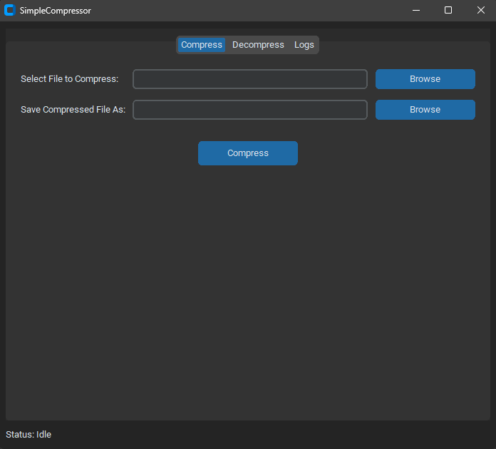

# PuffinZip - LZMA Compression Utility

**This application is currently in an active testing and development phase. May not work as intended. i am far from a professional and lack any skills in coding exclusing simple editing and being able to read the code itself**

**This Comepression/ Decompression Application is inteded for use of files or folders under 100MB**

PuffinZip is a simple, user-friendly graphical application for compressing and decompressing files using the powerful LZMA algorithm. It aims to offer high compression ratios in a clean, dark-mode interface.

Initial tests on specific file types have shown that PuffinZip, using Python's LZMA implementation at preset 9, can achieve slightly higher compression rates than 7-Zip's LZMA/LZMA2 on its "Ultra" settings for those same files. However, compression performance can vary widely depending on file content and further comparative testing is encouraged.



## Features

*   **High Compression:** Employs LZMA (preset 9 via Python's `lzma` module) for maximal file size reduction.
*   **User-Friendly GUI:** Simple tabbed interface built with `customtkinter`.
    *   Compress Tab: Select file, choose output name (auto-suggested), and compress.
    *   Decompress Tab: Select `.lzma` file, choose output name (auto-suggested), and decompress.
    *   Logs Tab: View detailed operation logs.
*   **Dark Mode:** Easy on the eyes.
*   **Responsive Interface:** Long operations run in background threads, keeping the UI active.
*   **Progress Indicator:** An indeterminate progress bar shows when an operation is active.
*   **Status Updates:** Clear status messages for idle, working, success, or error states.
*   **Detailed Logging:** Operations are logged to `app_puffinzip.log` (created in the same folder as the EXE) for troubleshooting or review.

## Download & Installation (for Users)

1.  Go to the [**Releases Page**](https://github.com/Stelliro/PuffinZip/releases/tag/V1.0) of this repository. 
    *(Please ensure this link points to your actual GitHub repository's releases page!)*
2.  Download the latest `PuffinZip.exe` (or `PuffinZip_vX.Y.Z.exe`) file from the "Assets" section.
3.  Place the `.exe` file in a folder of your choice.
4.  Double-click `PuffinZip.exe` to run the application. No installation is required.
    **Note:** As this is an early release, your browser or Windows SmartScreen might show warnings. You may need to choose "Keep" or "Run anyway."

## How to Use

1.  Launch `PuffinZip.exe`. The application window will appear.

    **To Compress a File:**
    *   Navigate to the "Compress" tab.
    *   Click "Browse" to select the file you want to compress.
    *   The output filename (e.g., `yourfile.ext.lzma`) will be suggested. You can change it if needed.
    *   Click the "Compress" button.

    **To Decompress a File:**
    *   Navigate to the "Decompress" tab.
    *   Click "Browse" to select the `.lzma` file you want to decompress.
    *   The original filename will be suggested as the output. You can change it.
    *   Click the "Decompress" button.

    **Note on Performance:** PuffinZip uses LZMA's highest compression setting (preset 9). This generally provides excellent compression ratios but can be time-consuming, especially for larger files (even those under 100MB). The UI will remain responsive (progress bar animating) during these operations.

---

## For Developers / Running from Source

If you prefer to run PuffinZip directly from the Python source code, review its development, or contribute:

### Requirements

*   Python 3.6 or newer
*   `customtkinter` library

### Setup

1.  Clone the repository or download the source code.
2.  Ensure you have Python 3.6+ installed.
3.  It is highly recommended to set up a virtual environment:
    ```bash
    python -m venv .venv
    # On Windows: .\.venv\Scripts\activate
    # On macOS/Linux: source .venv/bin/activate
    ```
4.  Install the required `customtkinter` library:
    ```bash
    pip install customtkinter
    ```
5.  Navigate to the source code directory and run the script:
    ```bash
    python PuffinZip.py
    ```
    *(Assuming your Python script is named `PuffinZip.py`)*

### Building an Executable from Source

You can create a standalone executable using PyInstaller (preferably within your activated virtual environment):

1.  Install PyInstaller: `pip install pyinstaller`
2.  Navigate to the script's directory and run (from your terminal/command prompt):
    ```bash
    python -m PyInstaller --onefile --windowed --icon="your_icon.ico" PuffinZip.py
    ```
    *(Replace `your_icon.ico` with the path to your icon file. Or `py -m PyInstaller ...` if you use the `py` launcher)*
    
    **Note for `customtkinter` Theming:** For `customtkinter` themes to work correctly in the compiled EXE, PyInstaller might need help finding the theme assets. You might need to use the `--add-data` flag. For example:
    
    First, find your `customtkinter` assets path (e.g., by running `python -c "import customtkinter, os; print(os.path.join(os.path.dirname(customtkinter.__file__), 'assets'))"` in Python within the active venv).
    
    Then, adjust the PyInstaller command:
    ```bash
    python -m PyInstaller --onefile --windowed --icon="your_icon.ico" --add-data "FULL_PATH_TO_CUSTOMTKINTER_ASSETS;customtkinter/assets" PuffinZip.py
    ```
    Replace `FULL_PATH_TO_CUSTOMTKINTER_ASSETS` with the actual path you found. The semicolon (`;`) is for Windows; use a colon (`:`) for Linux/macOS.

---

## Credits

*   **Concept and Direction:** Stelliro
*   **Core Implementation and Iterative Development:** AI Assistant (Gemini)

## Contributing

PuffinZip is in active development, and contributions are welcome!
*   **Feedback:** If you encounter any bugs or have suggestions for improvements, especially regarding compression performance on different file types, please open an issue.
*   **Pull Requests:** Feel free to fork the repository, make your changes, and submit a pull request.
